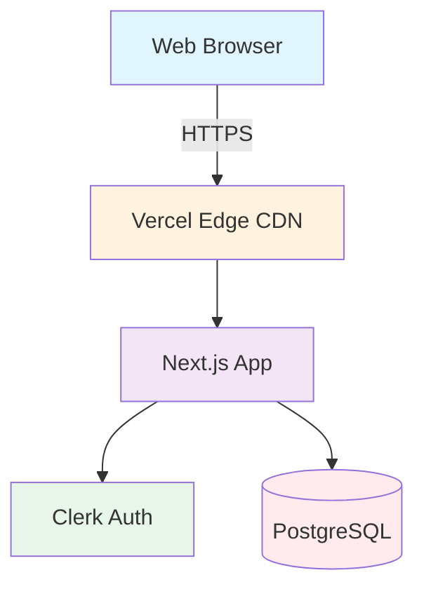
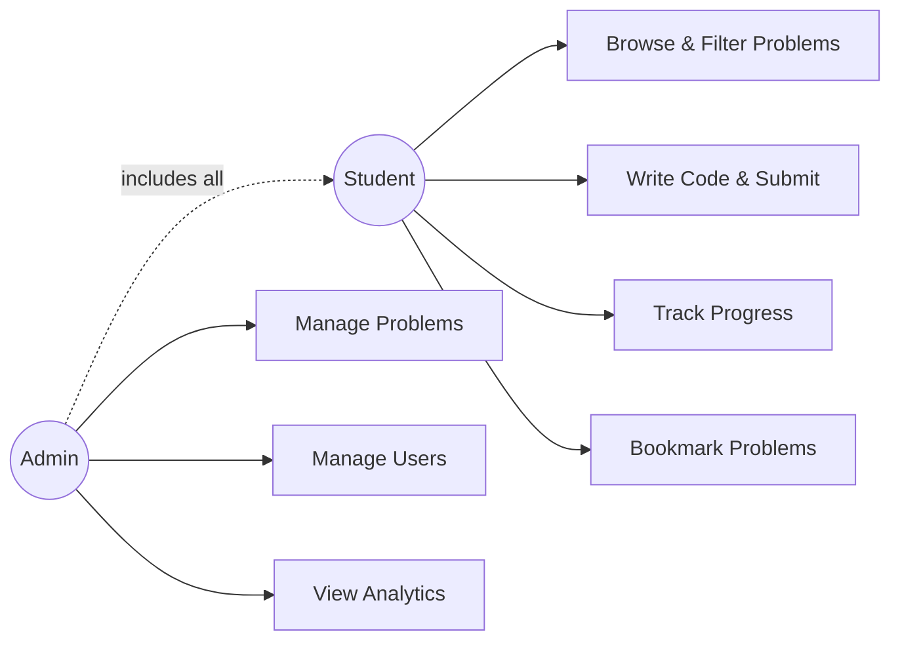
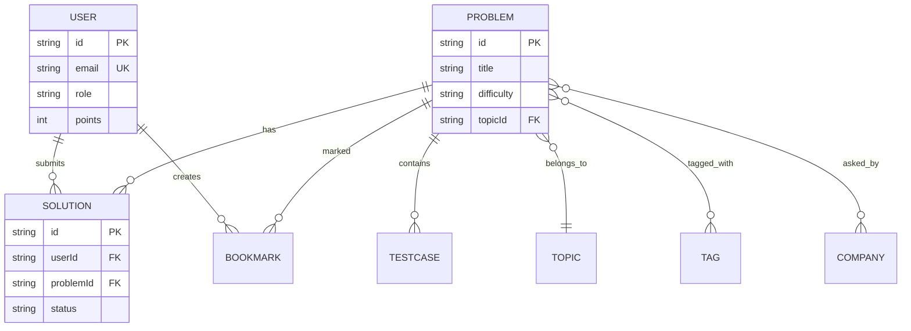
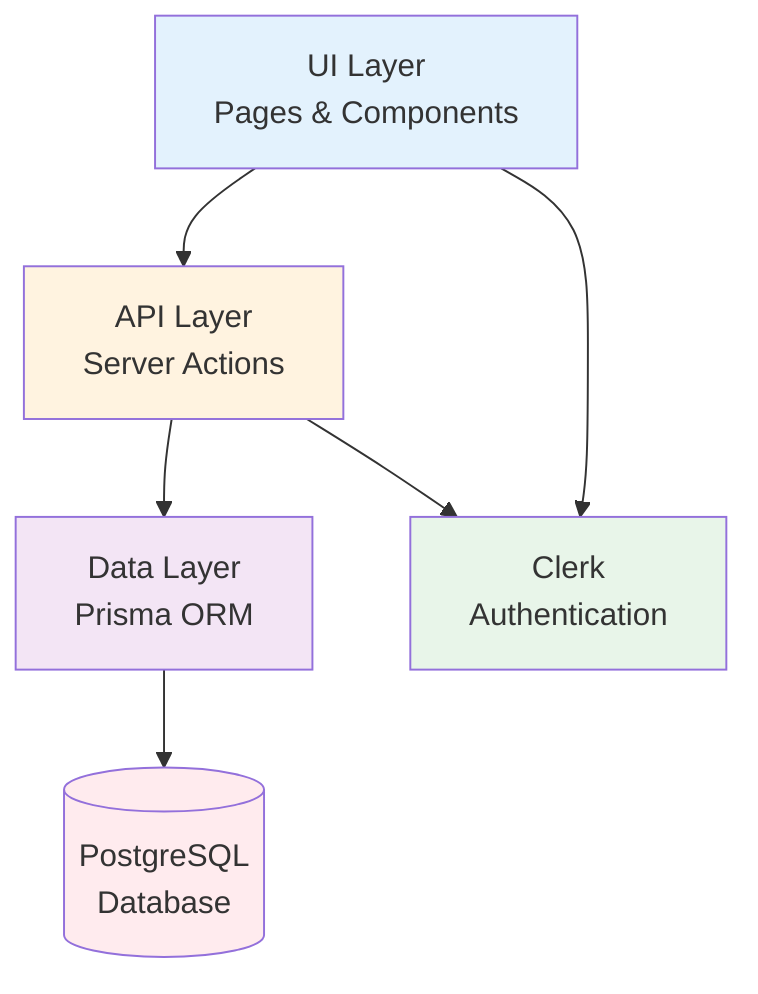
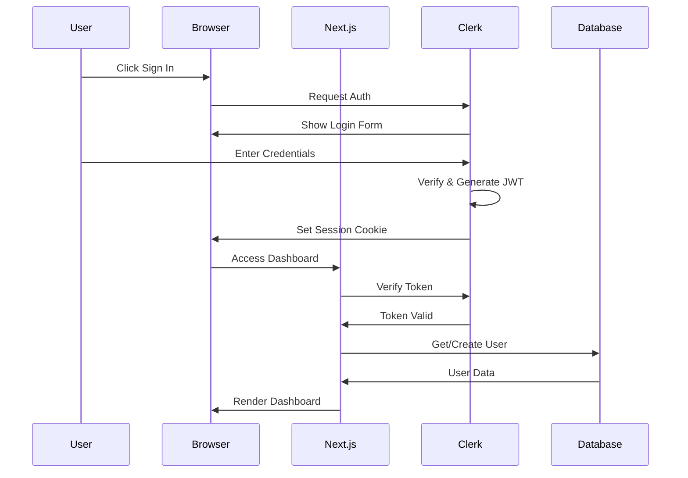
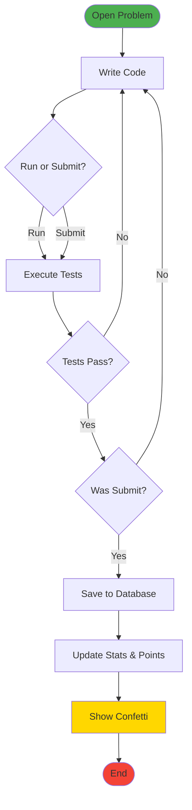

# 📊 SDLC Diagrams - Mermaid Codes & Report Locations

## 🎯 Overview
This document contains all Mermaid codes for SDLC diagrams to be inserted in the IEEE report.

---

## 📍 DIAGRAM LOCATIONS IN REPORT

| Diagram | Figure No. | Chapter | Section | Page (Approx) |
|---------|-----------|---------|---------|---------------|
| System Architecture | Fig 3.1 | Chapter 3 | 3.3 System Design | ~Page 9-10 |
| Use Case Diagram | Fig 3.2 | Chapter 3 | 3.3 System Design | ~Page 10 |
| ER Diagram | Fig 3.3 | Chapter 3 | 3.4 Database Design | ~Page 11-12 |
| Component Diagram | Fig 3.5 (NEW) | Chapter 3 | 3.3 System Design | ~Page 10 |
| Sequence Diagram | Fig 3.6 (NEW) | Chapter 3 | 3.3 System Design | ~Page 11 |
| Activity Diagram | Fig 4.3 (NEW) | Chapter 4 | 4.2 Core Features | ~Page 16 |

---

## 📋 HOW TO USE IN DRAW.IO

1. Open **Draw.io** (https://app.diagrams.net/)
2. Click **Arrange** → **Insert** → **Advanced** → **Mermaid**
3. **Copy** the Mermaid code from below
4. **Paste** into the Mermaid dialog
5. Click **Insert** to generate diagram
6. **Export** as PNG (File → Export as → PNG)
7. **Insert** the PNG image in report at the placeholder location

---

## 🎨 MERMAID CODE #1: System Architecture Diagram (Fig 3.1)

**Location:** Chapter 3.3 - System Design

---

## 🎨 MERMAID CODE #2: Use Case Diagram (Fig 3.2)

**Location:** Chapter 3.3 - System Design

---

## 🎨 MERMAID CODE #3: ER Diagram (Fig 3.3)

**Location:** Chapter 3.4 - Database Design

---

## 🎨 MERMAID CODE #4: Component Diagram (Fig 3.5)

**Location:** Chapter 3.3 - System Design (OPTIONAL - add if space available)

---

## 🎨 MERMAID CODE #5: Sequence Diagram - Authentication (Fig 3.6)

**Location:** Chapter 3.3 - System Design (OPTIONAL - add if space available)

---

## 🎨 MERMAID CODE #6: Activity Diagram - Code Submission (Fig 4.3)

**Location:** Chapter 4.2 - Core Features Implementation (OPTIONAL - add if space available)

---

## ✅ MUST-HAVE DIAGRAMS (Top Priority)

These 3 diagrams are ESSENTIAL for SDLC compliance:

1. **Figure 3.1 - System Architecture** ✅ MUST ADD
2. **Figure 3.2 - Use Case Diagram** ✅ MUST ADD  
3. **Figure 3.3 - ER Diagram** ✅ MUST ADD

---

## 📌 OPTIONAL DIAGRAMS (If Space Available)

Add these if report has extra space:

4. **Figure 3.5 - Component Diagram** (Good to have)
5. **Figure 3.6 - Sequence Diagram** (Good to have)
6. **Figure 4.3 - Activity Diagram** (Good to have)

---

## 🎯 PLACEHOLDER LOCATIONS IN REPORT

Search for these texts in the report to find where to insert diagrams:

1. **"[INSERT DIAGRAM HERE: Use Mermaid Code #1 - System Architecture]"**
2. **"[INSERT DIAGRAM HERE: Use Mermaid Code #2 - Use Case Diagram]"**
3. **"[INSERT DIAGRAM HERE: Use Mermaid Code #3 - ER Diagram]"**

---

## 📏 DIAGRAM SIZE RECOMMENDATIONS

When exporting from Draw.io:

- **Width**: 600-700 pixels (fits well in report)
- **Height**: Auto (maintain aspect ratio)
- **Format**: PNG with transparent background
- **DPI**: 300 (high quality for printing)

---

## ✅ CHECKLIST

- [ ] Copy Mermaid Code #1 (System Architecture)
- [ ] Paste in Draw.io → Insert → Mermaid
- [ ] Export as PNG (600px width)
- [ ] Insert in report at Figure 3.1 placeholder
- [ ] Repeat for Use Case Diagram (Fig 3.2)
- [ ] Repeat for ER Diagram (Fig 3.3)
- [ ] Verify all diagrams are visible in report
- [ ] Update LIST OF FIGURES in Table of Contents

---

## 🎉 DONE!

After adding all 3 must-have diagrams, your report will have complete SDLC documentation! 🚀
